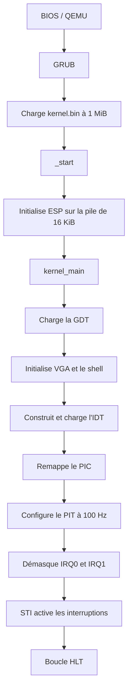
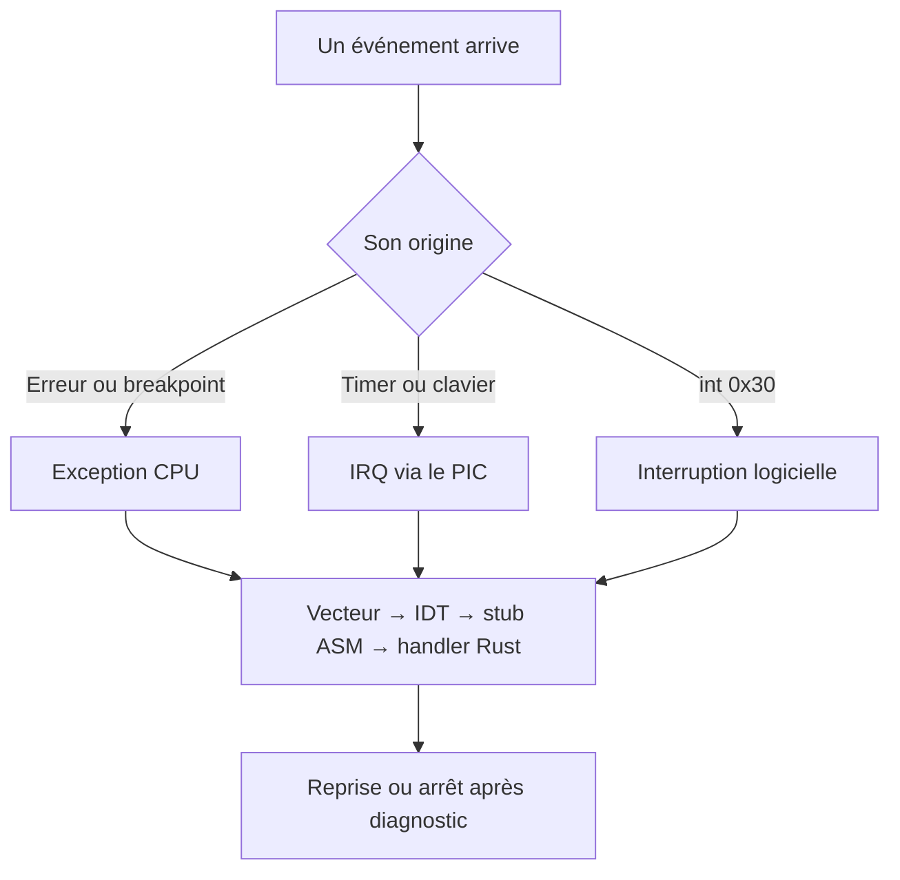
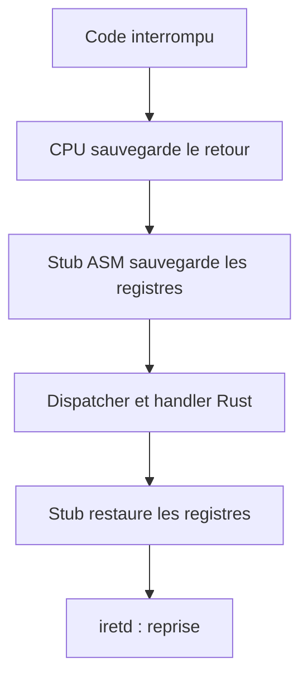
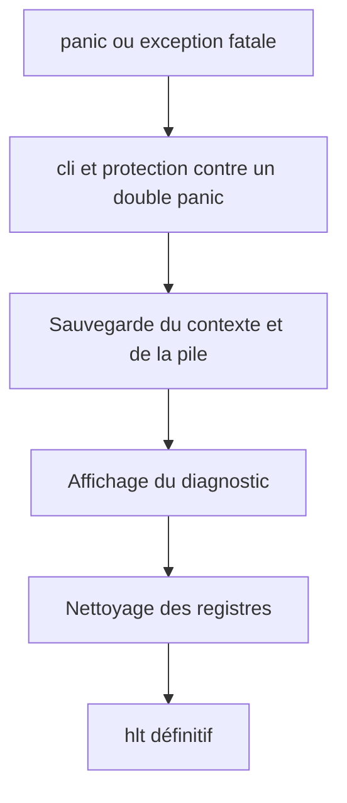

# Kernel From Scratch — KFS-1, KFS-2 et KFS-4

Noyau éducatif **i386** écrit en Rust `no_std` et en assembleur NASM. GRUB
charge le noyau, QEMU l'exécute et le terminal VGA sert d'interface de
débogage.

Le dépôt contient les bases de KFS-1, la GDT et la pile de KFS-2, ainsi que la
partie obligatoire de KFS-4 : IDT, exceptions, interruptions matérielles et
logicielles, callbacks, signaux planifiables, clavier sur IRQ et gestion
globale des panics.

Les bonus de KFS-4 ne sont volontairement pas implémentés : il n'y a ni base de
syscalls, ni gestion de plusieurs dispositions de clavier, ni nouveau
`get_line`.

## Accès rapide

- [Parcours de compréhension : 11 étapes](#parcours-kfs4)
  1. [Pourquoi les interruptions ?](#etape-1)
  2. [L'IDT](#etape-2)
  3. [Les stubs assembleur](#etape-3)
  4. [Les exceptions CPU](#etape-4)
  5. [Le PIC](#etape-5)
  6. [Le PIT et `hlt`](#etape-6)
  7. [Le clavier](#etape-7)
  8. [L'interruption logicielle](#etape-8)
  9. [Les signaux et callbacks](#etape-9)
  10. [Le panic](#etape-10)
  11. [La démo et les exigences](#etape-11)
- [Construire et lancer](#construire-et-lancer)
- [Concepts hérités de KFS-1 et KFS-2](#concepts-hérités-de-kfs-1-et-kfs-2)
- [Organisation du code](#organisation-du-code)
- [Commandes de démonstration](#commandes-de-démonstration)
- [Guide de test manuel](#guide-de-test-manuel)
- [Scénario conseillé pour la soutenance](#scénario-conseillé-pour-la-soutenance)

## État et conformité aux sujets

### KFS-1

- en-tête Multiboot et chargement par GRUB ;
- point d'entrée assembleur `_start` ;
- pile kernel initiale de 16 KiB ;
- cible personnalisée i386 et script de linkage ;
- noyau Rust sans bibliothèque standard ;
- terminal VGA 80 × 25, curseur, couleurs et scrollback ;
- clavier PS/2 et shell de débogage.

### KFS-2

- GDT à l'adresse imposée `0x00000800` ;
- segments code, données et pile pour le kernel et le userland ;
- chargement de `GDTR` et rechargement des registres de segment ;
- dump lisible de la pile kernel ;
- taille du projet limitée à 10 MiB par le Makefile.

### KFS-4 obligatoire

| Exigence | Implémentation |
|---|---|
| Créer, remplir et charger une IDT | 256 entrées dans `interrupts.rs`, chargées avec `lidt` |
| Interruptions matérielles | PIC remappé, IRQ0 timer et IRQ1 clavier |
| Interruptions logicielles | vecteur kernel `0x30`, déclenchable avec `int 0x30` |
| Gestion des exceptions | vecteurs CPU `0..31` et handlers avec/sans code d'erreur |
| Système signal/callback | enregistrement, suppression et émission dans `signals.rs` |
| Planification de signaux | file fixe déclenchée par les ticks du PIT |
| Nettoyage des registres | routine assembleur `cpu_halt_clean` |
| Sauvegarde de la pile avant panic | snapshot borné de 16 mots |
| Panic global | diagnostic, contexte CPU, pile, protection contre le double panic |
| Clavier à travers l'IDT | IRQ1 lit le scancode et appelle le gestionnaire existant |

## KFS-4 en une minute

Ce projet fait passer le noyau d'une vérification répétée du clavier à une
réaction aux événements. Le clavier et le timer émettent des IRQ via le PIC ;
le CPU peut aussi déclencher une exception ou exécuter `int 0x30`.
L'IDT dirige chaque vecteur vers un stub assembleur, puis un handler Rust.
Le noyau reprend ensuite l'exécution ou s'arrête après un diagnostic fatal.

Pour suivre un exemple concret du début à la fin, commence par le
[parcours en 11 étapes](#parcours-kfs4).

## Construire et lancer

### Fedora avec Podman

Le chemin recommandé à l'école ne nécessite pas d'installer la toolchain Rust
sur Fedora :

```bash
sudo dnf install podman qemu-system-x86
make container-build
make run
```

Podman est le moteur par défaut. Le volume utilise le suffixe `:z` nécessaire
sur une machine où SELinux est actif.

```bash
make podman-build
make CONTAINER=podman container-build
```

Docker reste utilisable hors de l'école :

```bash
make docker-build
```

### Build natif

Il faut Rust nightly avec `rust-src`, NASM, GNU `ld`, les outils GRUB i386,
`xorriso`, `make` et QEMU.

```bash
rustup toolchain install nightly --component rust-src
make            # construit kernel.iso
make run        # construit si nécessaire puis démarre QEMU
make clean      # supprime les objets intermédiaires
make fclean     # supprime aussi kernel.iso
make re         # reconstruction complète
```

Le Makefile reconnaît `grub-mkrescue`, `grub2-mkrescue` sur Fedora et
`i686-elf-grub-mkrescue`. Il recompile le noyau lorsqu'un fichier Rust change.

## Démarrage, étape par étape

```text
BIOS / QEMU
    │
    ▼
GRUB trouve l'en-tête Multiboot
    │
    ▼
GRUB charge kernel.bin à partir de 1 MiB
    │
    ▼
_start
    ├── place ESP au sommet de la pile de 16 KiB
    └── appelle kernel_main
          │
          ├── charge la GDT
          ├── initialise le terminal VGA
          ├── initialise le shell et les callbacks
          ├── construit et charge l'IDT
          ├── remappe et configure le PIC
          ├── configure le PIT à 100 Hz
          ├── démasque IRQ0 et IRQ1
          └── active les interruptions avec STI
                    │
                    ▼
              boucle HLT au repos
```

La même séquence sous forme de schéma :



Le CPU ne boucle plus en interrogeant continuellement le clavier. Il dort avec
`hlt`, puis une interruption le réveille. Le timer produit IRQ0 et le clavier
produit IRQ1.

## Concepts hérités de KFS-1 et KFS-2

### Pourquoi `no_std` et `no_main` ?

Un noyau s'exécute sans système d'exploitation sous-jacent. La bibliothèque
`std` suppose déjà l'existence de fichiers, de threads, de mémoire virtuelle
et d'appels système.

- `#![no_std]` conserve la bibliothèque `core` ;
- `#![no_main]` retire le point d'entrée Rust habituel ;
- `_start` est fourni par `boot/boot.asm` ;
- les panics n'utilisent aucun runtime hôte ;
- une primitive `memcpy` minimale est fournie localement.

### La pile initiale

`boot/boot.asm` réserve 16 KiB dans `.bss` :

```asm
stack_bottom:
    resb 16384
stack_top:
```

La pile x86 grandit vers les adresses basses. `ESP` commence donc à
`stack_top`, puis chaque `push` le décrémente.

Les symboles `stack_bottom` et `stack_top` sont exportés. Le gestionnaire de
panic peut ainsi vérifier qu'une adresse appartient réellement à la pile avant
de la lire.

### La GDT

Un registre de segment contient un sélecteur vers la Global Descriptor Table.
La GDT définit la base, la limite, les droits et le niveau de privilège de
chaque segment.

| Index | Sélecteur | Segment | Privilège | Accès |
|---:|---:|---|---:|---:|
| 0 | `0x00` | nul | — | `0x00` |
| 1 | `0x08` | code kernel | ring 0 | `0x9A` |
| 2 | `0x10` | données kernel | ring 0 | `0x92` |
| 3 | `0x18` | pile kernel | ring 0 | `0x92` |
| 4 | `0x20` | code user | ring 3 | `0xFA` |
| 5 | `0x28` | données user | ring 3 | `0xF2` |
| 6 | `0x30` | pile user | ring 3 | `0xF2` |

Les segments utilisent une base nulle et couvrent l'espace 32 bits : c'est le
modèle mémoire flat. La GDT est écrite à `0x800`, `lgdt` charge `GDTR`, les
registres de données sont rechargés et un retour lointain recharge `CS`.

<a id="parcours-kfs4"></a>
## Parcours de compréhension : 11 étapes

Ce parcours part de ce que tu fais dans QEMU. Pour chaque étape : une idée, un
événement concret, puis le rôle du composant. Les exemples de sortie illustrent
le comportement attendu ; les valeurs des ticks et les adresses changent à
chaque exécution.



<a id="etape-1"></a>
### 1. Pourquoi les interruptions ?

**Idée :** le noyau réagit à un événement lorsqu'il survient. Auparavant, la
gestion du clavier vérifiait régulièrement si une touche était disponible :
c'est le *polling*. La boucle vérifiait même quand personne ne tapait.

**Exemple :** le prompt `>` attend. Tu presses `h`. Le clavier déclenche une
interruption, le noyau traite la touche et affiche `h`. Entre les événements,
la boucle principale peut attendre avec `hlt`.

Il y a trois origines possibles : le CPU détecte une **exception** (`ud2`), un
périphérique émet une **IRQ** (clavier ou timer), ou le code lance une
**interruption logicielle** (`int 0x30`). Elles passent toutes par un numéro de
vecteur et l'IDT. Le terme « asynchrone » donne une intuition, mais ici le CPU
peut suspendre le code en cours pour traiter l'événement.

<a id="etape-2"></a>
### 2. L'IDT : trouver le bon traitement

**Idée :** l'*Interrupt Descriptor Table* associe un numéro de vecteur à
l'adresse du code à exécuter. C'est une table de routage pour le CPU.

| Action | Vecteur | Entrée utilisée |
|---|---:|---|
| `int3` | 3 | IDT[3], breakpoint |
| `fault` (`ud2`) | 6 | IDT[6], instruction invalide |
| Tick du timer | 32 | IDT[32], IRQ0 |
| Touche du clavier | 33 | IDT[33], IRQ1 |
| `softint` (`int 0x30`) | 48 | IDT[48], interruption logicielle |

L'IDT contient 256 entrées de 8 octets. Chaque entrée contient notamment deux
moitiés de l'adresse du stub, le sélecteur du segment code kernel `0x08` et des
attributs (`0x8E` pour les portes d'interruption utilisées ici). `lidt` charge
l'adresse et la limite de la table dans `IDTR`. Pour 256 entrées, la limite vaut
`256 × 8 - 1 = 2047`.

**Différence avec la GDT :** la GDT définit les segments et leurs droits ;
l'IDT indique quoi exécuter pour un événement donné. L'entrée IDT utilise le
segment code kernel défini dans la GDT.

<a id="etape-3"></a>
### 3. Le stub assembleur : préserver l'état du CPU

**Idée :** une interruption suspend du code en cours. Pour le reprendre sans
modifier ses calculs, le noyau doit conserver ses registres.

**Exemple :** tu tapes une touche alors que le noyau attend. Le CPU empile les
informations de retour (`EIP`, `CS`, `EFLAGS`), puis arrive au stub indiqué par
l'IDT. Le stub sauvegarde les autres registres, charge le segment de données
kernel, et appelle le dispatcher Rust. Après le traitement, il restaure l'état
et exécute `iretd`. Si le handler est récupérable, le code reprend.



Certaines exceptions fournissent un **code d'erreur** (`#GP`), d'autres non
(`int3`, `#UD`, IRQ). Les stubs ajoutent un zéro lorsqu'il n'y en a pas : Rust
reçoit ainsi toujours un contexte de même forme. `int3` est un test parlant :
si le message s'affiche **et que le prompt revient**, le trajet aller-retour
fonctionne.

<a id="etape-4"></a>
### 4. Les exceptions : le CPU signale une situation

**Idée :** une exception vient du CPU pendant l'exécution d'une instruction.
Elle emprunte l'IDT comme les IRQ, même si elle ne vient pas d'un périphérique.

| Commande | Ce qu'elle provoque | Résultat dans ce noyau |
|---|---|---|
| `int3` | Breakpoint, vecteur 3 | Diagnostic puis retour au prompt |
| `fault` | `ud2`, instruction invalide, vecteur 6 | Diagnostic puis arrêt |
| `gpf` | Sélecteur invalide, `#GP`, vecteur 13 | Diagnostic avec code d'erreur puis arrêt |

**Exemple concret :** `fault` exécute `ud2`. Le CPU appelle le handler du
vecteur 6. Le noyau affiche la cause et le contexte, puis s'arrête au lieu de
revenir sur l'instruction invalide. Une page fault utilise le vecteur 14 ;
`CR2` donne l'adresse mémoire concernée. Toutes les exceptions ne sont donc
pas fatales : le breakpoint est volontairement récupérable ici.

<a id="etape-5"></a>
### 5. Le PIC : traduire une IRQ en vecteur

**Idée :** le PIC reçoit les interruptions matérielles et les présente au CPU
avec des numéros qui ne chevauchent pas les exceptions. Il est remappé vers les
vecteurs 32 à 47.

```text
Timer   → IRQ0 → PIC → vecteur 32 → IDT[32]
Clavier → IRQ1 → PIC → vecteur 33 → IDT[33]
```

**Exemple :** tu presses `h`. La ligne matérielle est **IRQ1**, mais le CPU
consulte **IDT[33]** après remapping. Au démarrage, toutes les IRQ sont
masquées ; le noyau démasque seulement IRQ0 et IRQ1. Une fois une IRQ réelle
traitée, le handler envoie un **EOI** (*End of Interrupt*) au PIC. `int3` et
`int 0x30` n'en ont pas besoin : ces événements ne proviennent pas du PIC.

Le PIC maître gère IRQ0..7 et l'esclave IRQ8..15, raccordé via IRQ2. Le code
prévoit les cas particuliers des IRQ7 et IRQ15 parasites (*spurious*).

<a id="etape-6"></a>
### 6. Le PIT et `hlt` : compter le temps et attendre

**Idée :** le PIT fournit un tick environ 100 fois par seconde. `hlt` permet au
CPU d'attendre la prochaine interruption entre deux événements.

**Exemple A :** tu tapes `ticks`, attends deux secondes et retapes `ticks`.
Le compteur a augmenté d'environ 200 ; cela montre que PIT → IRQ0 →
IDT[32] → handler fonctionne.

```text
> ticks
info: timer ticks: 1250
... environ deux secondes ...
> ticks
info: timer ticks: 1450
```

**Exemple B :** tu tapes `signal` au tick 1450. Le noyau programme une échéance
vers 1550. Quand le PIT atteint ce tick, le callback s'exécute. Pendant ce
temps, si la boucle principale n'a rien à faire, elle attend avec `hlt` ; le
timer la réveille brièvement environ toutes les 10 ms. `hlt` attend donc une
interruption, pas une seconde entière d'un seul coup.

<a id="etape-7"></a>
### 7. Le clavier : de la touche au shell

**Idée :** le contrôleur PS/2 avertit le CPU ; le handler lit un *scancode*, le
décode et transmet un événement clavier au shell.

**Exemple :** tu tapes `help`. Pour chaque touche, le chemin est :

```text
Touche → scancode sur le port 0x60 → IRQ1 → vecteur 33
       → handler → KeyEvent → shell → caractère affiché → EOI → iretd
```

Quand tu presses Entrée, le shell exécute `help`. Voir les lettres **et** le
résultat de la commande valide la chaîne entière. Le décodage décrit dans le
README utilise les scancodes set 1 et une disposition QWERTY US ; sur un
clavier physique AZERTY, les lettres obtenues peuvent surprendre.

<a id="etape-8"></a>
### 8. `softint` : une interruption lancée par le code

**Idée :** l'instruction `int 0x30` provoque volontairement le vecteur 48. Il
n'y a ici ni périphérique ni EOI au PIC.

**Exemple :**

```text
> softint
info: software signal callback executed
>
```

Le shell exécute `int 0x30` ; IDT[48] mène au handler, qui émet
`KernelSignal::Software`. Le callback enregistré affiche le message, puis le
prompt revient. La porte reste réservée au kernel (DPL 0) : ce n'est pas un
syscall pour un processus utilisateur.

<a id="etape-9"></a>
### 9. Signaux et callbacks : maintenant ou plus tard

**Idée :** un signal est une notification **interne au noyau**. Un callback est
une fonction enregistrée à appeler quand cette notification est émise. Il ne
s'agit pas encore de signaux Unix envoyés à des processus.

| Commande | Ce que tu observes | Origine du déclenchement |
|---|---|---|
| `softint` | Callback immédiat | Handler de `int 0x30` |
| `signal` | Callback environ une seconde plus tard | Échéance vérifiée lors d'IRQ0 |

**Exemple :** si `signal` est exécuté au tick 500, la file conserve une
échéance vers le tick 600. Le timer vérifie cette file à chaque tick, puis
émet le signal à l'échéance. La commande différée ne signifie pas que le noyau
réexécute `int 0x30` plus tard : elle planifie la **notification**.

`signals.rs` expose `register_callback`, `unregister_callback`, `emit`,
`schedule_after`, `ticks` et `trigger_software_interrupt`. Les capacités sont
fixes : 20 catégories de signaux, au plus 4 callbacks par catégorie et 16
signaux différés. Les callbacks lancés depuis une interruption doivent rester
courts et ne pas attendre une ressource. Les modifications des tables sont
protégées en désactivant temporairement les interruptions puis en restaurant
l'état antérieur du bit IF.

<a id="etape-10"></a>
### 10. Panic : conserver le diagnostic avant l'arrêt

**Idée :** quand le noyau ne peut pas continuer, il sauvegarde les informations
utiles, les affiche, puis arrête volontairement le CPU.

**Exemple :** `fault` provoque `#UD`. Le prompt ne revient pas ; tu vois la
cause, le vecteur, des registres et un extrait de la pile. `gpf` montre en
plus un vrai code d'erreur CPU. `panic` teste le chemin du panic Rust.



La pile initiale fait 16 KiB ; les symboles `stack_bottom` et `stack_top`
permettent de borner la lecture. Le snapshot copie jusqu'à 16 mots valides.
Pour une exception, le contexte comporte notamment `EIP`, `ESP`, les
registres généraux, le vecteur et son code d'erreur. Un panic Rust n'a pas
nécessairement de cadre d'interruption complet. On sauvegarde et on affiche
**avant** de nettoyer les registres ; `ESP` reste utilisable. Le noyau coupe
les interruptions avant l'arrêt pour qu'un tick du timer ne le réveille pas.

<a id="etape-11"></a>
### 11. Relier la démo aux exigences du sujet

**Idée :** chaque commande doit prouver une partie identifiable de KFS-4.

| Ce que tu fais | Ce que cela montre |
|---|---|
| Démarrer et obtenir `>` | Noyau chargé, GDT/IDT et initialisation achevées |
| Taper `help` | Clavier via IRQ1, IDT et shell |
| Taper `ticks` deux fois | PIT, IRQ0 et compteur |
| Taper `int3` et retrouver `>` | Exception récupérable et restauration du contexte |
| Taper `softint` | Interruption logicielle et callback immédiat |
| Taper `signal` et attendre | Signal planifié puis déclenché par les ticks |
| Finir par `gpf` | Code d'erreur, diagnostic, pile et arrêt propre |

Le sujet impose l'architecture **i386**, un **Makefile**, le code et une image
virtuelle de base. Il laisse libres le langage et l'émulateur. Ce dépôt utilise
Rust `no_std`, NASM, un script de linkage propre au projet, GRUB et QEMU ; le
noyau ne dépend pas des bibliothèques du système hôte.

Les bonus cités par le sujet (base de syscalls, plusieurs dispositions de
clavier, `get_line`) ne font pas partie de cette implémentation. Les tests
fatals sont à lancer en dernier, car `panic`, `fault` et `gpf` arrêtent
volontairement le CPU.

**Résumé oral :** « KFS-4 ajoute une IDT à mon noyau i386. Elle dirige les
exceptions, les IRQ du timer et du clavier, et une interruption logicielle.
Le timer sert aussi à planifier des callbacks ; les erreurs fatales donnent un
diagnostic avant l'arrêt. »


## Organisation du code

```text
boot/
├── boot.asm          Multiboot, pile initiale et _start
├── interrupts.asm    stubs, sauvegarde/restauration et arrêt propre
├── grub.cfg          configuration GRUB
├── linker.ls         linkage Linux/Fedora
└── linker_macos.ls   linkage macOS
src/
├── main.rs           ordre d'initialisation et boucle HLT
├── cpu.rs            IF, CLI/STI, CR2, ESP et arrêt
├── gdt.rs            GDT de KFS-2
├── interrupts.rs     IDT et dispatcher central
├── pic.rs            configuration du contrôleur 8259
├── pit.rs            timer à 100 Hz
├── signals.rs        callbacks et planification
├── kpanic.rs         snapshots et panic global
├── stack.rs          lecture bornée et affichage de la pile
├── shell.rs          commandes de débogage
├── libc.rs           memcpy minimal
├── inputs/
│   ├── io.rs         instructions in/out
│   └── handlers.rs   événements clavier
├── ps2/
│   ├── controller.rs contrôleur PS/2
│   └── keyboard.rs   décodage des scancodes
└── vga/
    └── terminal.rs   écran, curseur et scrollback
```

## Commandes de démonstration

| Commande | Action | Retour attendu |
|---|---|---|
| `help` | affiche l'aide | oui |
| `stack` | affiche 32 mots depuis ESP | oui |
| `ticks` | affiche le compteur IRQ0 | oui |
| `int3` | déclenche le breakpoint CPU | oui |
| `softint` | déclenche `int 0x30` | oui |
| `signal` | planifie un callback dans une seconde | oui |
| `clear` | efface l'écran | oui |
| `reboot` | redémarre via le contrôleur PS/2 | non |
| `halt` | nettoie les registres et arrête le CPU | non |
| `panic` | teste le panic Rust global | non |
| `fault` | teste l'exception fatale `#UD` | non |
| `gpf` | teste l'exception fatale `#GP` avec code d'erreur | non |

Les cinq commandes marquées « non » nécessitent de redémarrer la
machine virtuelle pour continuer.

## Guide de test manuel

### 1. Construire et démarrer

Sur Fedora avec Podman :

```bash
make container-build
make run
```

Avec la toolchain installée localement :

```bash
make re
make run
```

Le démarrage correct se termine par :

```text
info: IDT loaded; timer and keyboard interrupts enabled
>
```

### 2. Tester le timer

Exécuter deux fois `ticks` en attendant entre les deux appels :

```text
> ticks
info: timer ticks: 1250
> ticks
info: timer ticks: 1584
```

Le compteur doit augmenter. Cela valide le PIT, IRQ0, le PIC, l'IDT et le
retour avec `iretd`.

### 3. Tester le clavier

Taper `help`. Si le texte apparaît et que la commande est exécutée, la chaîne
IRQ1 → scancode → `KeyEvent` → shell fonctionne.

Le clavier du kernel est QWERTY US. Sur une machine physique AZERTY, il faut
raisonner selon les touches QWERTY si QEMU ne fait pas la traduction attendue.

### 4. Tester une exception récupérable

```text
> int3
debug: Breakpoint at 0x001.....
>
```

Le retour du prompt est essentiel : il prouve que les registres, `EIP`, `CS`
et `EFLAGS` ont été restaurés correctement.

### 5. Tester l'interruption logicielle

```text
> softint
info: software signal callback executed
```

Cette commande exécute `int 0x30`, traverse l'IDT et émet un signal logiciel.
Ce mécanisme reste interne au kernel et n'est pas un syscall.

### 6. Tester la planification

```text
> signal
info: software signal scheduled in one second
info: software signal callback executed
```

La seconde ligne doit apparaître environ une seconde plus tard. Elle valide la
file de planification et son déclenchement par IRQ0.

### 7. Tester les chemins fatals

Ces tests sont à lancer séparément car ils arrêtent volontairement le CPU.

`panic` teste le panic Rust :

```text
error: === KERNEL PANIC ===
```

`fault` exécute `ud2` et teste une exception sans code d'erreur :

```text
error: === FATAL CPU EXCEPTION ===
error: invalid opcode
error: vector=6 error=0x00000000 ...
```

`gpf` teste une exception avec code d'erreur :

```text
error: === FATAL CPU EXCEPTION ===
error: general protection fault
error: vector=13 error=0x0000fffc ...
```

Des lignes contenant `EAX`, `EBX`, `EIP`, `ESP` et la pile sauvegardée doivent
suivre. Quand l'affichage s'arrête, le kernel n'a pas crashé silencieusement :
il a terminé son diagnostic, nettoyé les registres et exécuté `hlt` avec les
interruptions désactivées.

## Raccourcis clavier

| Touche | Action |
|---|---|
| `F1` | aide clavier |
| `F2` | mode terminal / navigation |
| `F3` | effacer l'écran |
| `F4` | afficher ou masquer le curseur |
| `F5`, `F6`, `F7` | changer d'écran virtuel |
| `F8` | dump de la pile |
| `Page Up`, `Page Down` | parcourir le scrollback |
| `Ctrl+L` | effacer l'écran |
| `Ctrl+A`, `Ctrl+E` | début ou fin de ligne visuelle |

Les raccourcis qui ressemblent à des signaux Unix affichent seulement un
message. Le noyau ne possède encore ni processus ni userland.

## Scénario conseillé pour la soutenance

1. lancer `make re && make run` ;
2. expliquer le passage GRUB → `_start` → GDT → IDT ;
3. utiliser `ticks` deux fois pour montrer IRQ0 ;
4. taper du texte pour montrer que le clavier passe par IRQ1 ;
5. utiliser `int3` et continuer à taper ;
6. utiliser `softint` pour montrer le callback immédiat ;
7. utiliser `signal` et attendre une seconde ;
8. terminer avec `gpf` pour montrer le code d'erreur, le contexte et la pile sauvegardés.

Après `fault` ou `gpf`, le CPU est volontairement arrêté : c'est le résultat attendu,
pas un freeze accidentel.

## Tests réalisés

- reconstruction complète avec `make re` ;
- création d'une ISO largement inférieure à 10 MiB ;
- contrôle QEMU de `GDTR` et `IDTR` ;
- confirmation que la boucle principale dort avec IF actif ;
- progression du timer IRQ0 ;
- saisie et commandes via IRQ1 ;
- retour correct après `int3` ;
- interruption logicielle et callback immédiat ;
- signal planifié livré après une seconde ;
- panic Rust avec sauvegarde de pile ;
- exception `UD2` avec contexte matériel sauvegardé ;
- exception `#GP` avec code d'erreur sauvegardé ;
- registres généraux nettoyés avant l'arrêt final.
