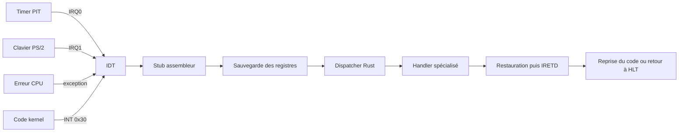
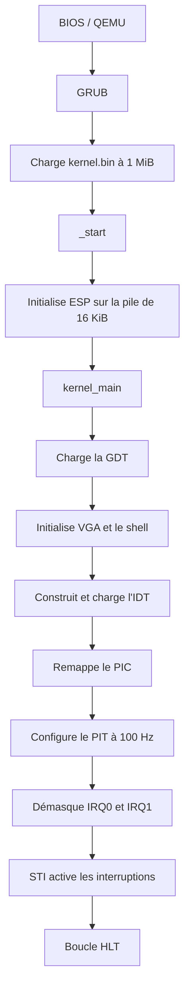
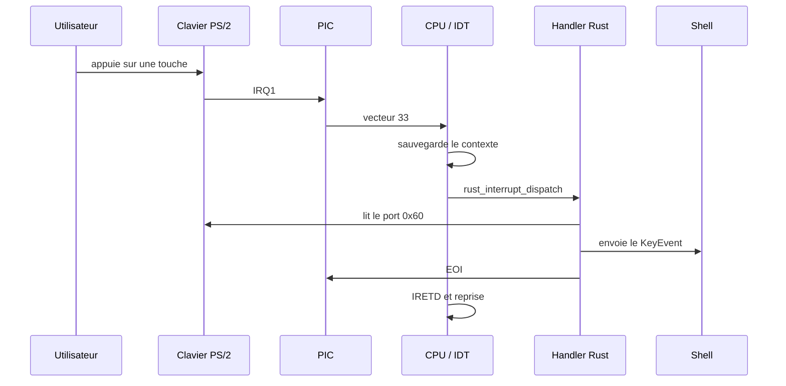
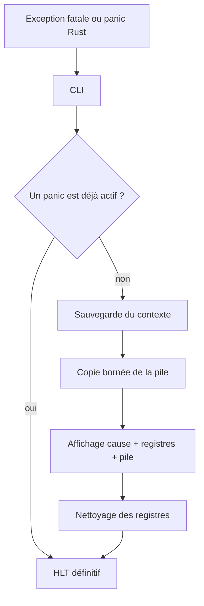

# Kernel From Scratch — KFS-1, KFS-2 et KFS-4

Noyau éducatif **i386** écrit en Rust `no_std` et en assembleur NASM. GRUB
charge le noyau, QEMU l'exécute et le terminal VGA sert d'interface de
débogage.

Le dépôt contient les bases de KFS-1, la GDT et la pile de KFS-2, ainsi que la
partie obligatoire de KFS-4 : IDT, exceptions, interruptions matérielles et
logicielles, callbacks, signaux planifiables, clavier sur IRQ et gestion
globale des panics.

Les bonus de KFS-4 ne sont volontairement pas implémentés : il n'y a ni base de
syscalls, ni gestion de plusieurs dispositions de clavier, ni nouveau
`get_line`.

## État et conformité aux sujets

### KFS-1

- en-tête Multiboot et chargement par GRUB ;
- point d'entrée assembleur `_start` ;
- pile kernel initiale de 16 KiB ;
- cible personnalisée i386 et script de linkage ;
- noyau Rust sans bibliothèque standard ;
- terminal VGA 80 × 25, curseur, couleurs et scrollback ;
- clavier PS/2 et shell de débogage.

### KFS-2

- GDT à l'adresse imposée `0x00000800` ;
- segments code, données et pile pour le kernel et le userland ;
- chargement de `GDTR` et rechargement des registres de segment ;
- dump lisible de la pile kernel ;
- taille du projet limitée à 10 MiB par le Makefile.

### KFS-4 obligatoire

| Exigence | Implémentation |
|---|---|
| Créer, remplir et charger une IDT | 256 entrées dans `interrupts.rs`, chargées avec `lidt` |
| Interruptions matérielles | PIC remappé, IRQ0 timer et IRQ1 clavier |
| Interruptions logicielles | vecteur kernel `0x30`, déclenchable avec `int 0x30` |
| Gestion des exceptions | vecteurs CPU `0..31` et handlers avec/sans code d'erreur |
| Système signal/callback | enregistrement, suppression et émission dans `signals.rs` |
| Planification de signaux | file fixe déclenchée par les ticks du PIT |
| Nettoyage des registres | routine assembleur `cpu_halt_clean` |
| Sauvegarde de la pile avant panic | snapshot borné de 16 mots |
| Panic global | diagnostic, contexte CPU, pile, protection contre le double panic |
| Clavier à travers l'IDT | IRQ1 lit le scancode et appelle le gestionnaire existant |

## Comprendre KFS-4 en deux minutes

Avant KFS-4, le kernel demandait continuellement au clavier s'il avait reçu une
touche. C'est du **polling** : le CPU travaille même lorsqu'il ne se passe rien.

Avec KFS-4, le sens de la communication est inversé : le CPU dort et le
matériel l'interrompt uniquement lorsqu'un événement arrive.



Les composants ont chacun un rôle précis :

| Composant | Rôle simple |
|---|---|
| GDT | décrit les segments mémoire et les privilèges |
| IDT | associe un événement à un handler |
| PIC | reçoit et numérote les interruptions matérielles |
| PIT | produit une interruption régulière pour mesurer le temps |
| Stub assembleur | sauvegarde l'état du programme interrompu |
| Dispatcher | choisit le bon traitement Rust |
| EOI | indique au PIC que l'IRQ est terminée |
| `iretd` | reprend le programme exactement où il était |

Le trajet générique d'une interruption est donc :

```text
événement → numéro de vecteur → IDT → stub ASM → dispatcher → handler → IRETD
```

## Construire et lancer

### Fedora avec Podman

Le chemin recommandé à l'école ne nécessite pas d'installer la toolchain Rust
sur Fedora :

```bash
sudo dnf install podman qemu-system-x86
make container-build
make run
```

Podman est le moteur par défaut. Le volume utilise le suffixe `:z` nécessaire
sur une machine où SELinux est actif.

```bash
make podman-build
make CONTAINER=podman container-build
```

Docker reste utilisable hors de l'école :

```bash
make docker-build
```

### Build natif

Il faut Rust nightly avec `rust-src`, NASM, GNU `ld`, les outils GRUB i386,
`xorriso`, `make` et QEMU.

```bash
rustup toolchain install nightly --component rust-src
make            # construit kernel.iso
make run        # construit si nécessaire puis démarre QEMU
make clean      # supprime les objets intermédiaires
make fclean     # supprime aussi kernel.iso
make re         # reconstruction complète
```

Le Makefile reconnaît `grub-mkrescue`, `grub2-mkrescue` sur Fedora et
`i686-elf-grub-mkrescue`. Il recompile le noyau lorsqu'un fichier Rust change.

## Démarrage, étape par étape

```text
BIOS / QEMU
    │
    ▼
GRUB trouve l'en-tête Multiboot
    │
    ▼
GRUB charge kernel.bin à partir de 1 MiB
    │
    ▼
_start
    ├── place ESP au sommet de la pile de 16 KiB
    └── appelle kernel_main
          │
          ├── charge la GDT
          ├── initialise le terminal VGA
          ├── initialise le shell et les callbacks
          ├── construit et charge l'IDT
          ├── remappe et configure le PIC
          ├── configure le PIT à 100 Hz
          ├── démasque IRQ0 et IRQ1
          └── active les interruptions avec STI
                    │
                    ▼
              boucle HLT au repos
```

La même séquence sous forme de schéma :



Le CPU ne boucle plus en interrogeant continuellement le clavier. Il dort avec
`hlt`, puis une interruption le réveille. Le timer produit IRQ0 et le clavier
produit IRQ1.

## Concepts hérités de KFS-1 et KFS-2

### Pourquoi `no_std` et `no_main` ?

Un noyau s'exécute sans système d'exploitation sous-jacent. La bibliothèque
`std` suppose déjà l'existence de fichiers, de threads, de mémoire virtuelle
et d'appels système.

- `#![no_std]` conserve la bibliothèque `core` ;
- `#![no_main]` retire le point d'entrée Rust habituel ;
- `_start` est fourni par `boot/boot.asm` ;
- les panics n'utilisent aucun runtime hôte ;
- une primitive `memcpy` minimale est fournie localement.

### La pile initiale

`boot/boot.asm` réserve 16 KiB dans `.bss` :

```asm
stack_bottom:
    resb 16384
stack_top:
```

La pile x86 grandit vers les adresses basses. `ESP` commence donc à
`stack_top`, puis chaque `push` le décrémente.

Les symboles `stack_bottom` et `stack_top` sont exportés. Le gestionnaire de
panic peut ainsi vérifier qu'une adresse appartient réellement à la pile avant
de la lire.

### La GDT

Un registre de segment contient un sélecteur vers la Global Descriptor Table.
La GDT définit la base, la limite, les droits et le niveau de privilège de
chaque segment.

| Index | Sélecteur | Segment | Privilège | Accès |
|---:|---:|---|---:|---:|
| 0 | `0x00` | nul | — | `0x00` |
| 1 | `0x08` | code kernel | ring 0 | `0x9A` |
| 2 | `0x10` | données kernel | ring 0 | `0x92` |
| 3 | `0x18` | pile kernel | ring 0 | `0x92` |
| 4 | `0x20` | code user | ring 3 | `0xFA` |
| 5 | `0x28` | données user | ring 3 | `0xF2` |
| 6 | `0x30` | pile user | ring 3 | `0xF2` |

Les segments utilisent une base nulle et couvrent l'espace 32 bits : c'est le
modèle mémoire flat. La GDT est écrite à `0x800`, `lgdt` charge `GDTR`, les
registres de données sont rechargés et un retour lointain recharge `CS`.

## KFS-4 en détail

### Étape 1 — structure de l'IDT

L'Interrupt Descriptor Table contient 256 portes de 8 octets :

```text
 31                         16 15                            0
+-----------------------------+------------------------------+
|      offset bits 16..31     | attributs | 0 | sélecteur CS |
+-----------------------------+------------------------------+
|                     offset bits 0..15                      |
+------------------------------------------------------------+
```

Dans le code, les champs sont :

```rust
offset_low:  u16
selector:    u16
zero:        u8
attributes:  u8
offset_high: u16
```

Toutes les entrées sont présentes. Les vecteurs `0..48` possèdent un stub
dédié et les autres pointent vers un fallback sûr. Chaque porte utilise le
sélecteur de code kernel `0x08` et l'attribut `0x8E` :

- bit Present à 1 ;
- DPL 0 ;
- porte d'interruption 32 bits ;
- le CPU masque automatiquement les interruptions pendant le handler.

`IDTR` contient la taille de la table moins un et son adresse. L'instruction
`lidt` rend ensuite la table active.

### Étape 2 — stubs assembleur et contexte CPU

À l'entrée d'une interruption, le CPU empile au minimum :

```text
EFLAGS
CS
EIP
```

Certaines exceptions empilent également un code d'erreur. Pour présenter
toujours la même structure à Rust :

- un stub sans code d'erreur pousse un zéro puis le numéro du vecteur ;
- un stub avec code d'erreur pousse seulement le numéro du vecteur ;
- le point commun sauvegarde les segments et exécute `pushad`.

Le dispatcher Rust reçoit alors ce contexte :

```text
EDI ESI EBP ESP_sauvé EBX EDX ECX EAX
GS  FS  ES  DS
vecteur code_erreur
EIP CS EFLAGS
```

Avant d'appeler Rust, le stub charge le segment de données kernel `0x10`.
Après le traitement, il restaure les registres, retire le vecteur et le code
d'erreur, puis exécute `iretd`.

Ce passage assembleur est important : une fonction Rust normale utilise les
registres et ne peut pas deviner la disposition spéciale créée par le CPU.

### Étape 3 — exceptions CPU

Les vecteurs `0..31` sont réservés aux exceptions. Par exemple :

| Vecteur | Exception |
|---:|---|
| 0 | division par zéro |
| 3 | breakpoint |
| 6 | instruction invalide |
| 8 | double fault |
| 13 | general protection fault |
| 14 | page fault |

Le breakpoint est récupérable : le noyau affiche l'adresse puis reprend
l'exécution. Les autres exceptions sont traitées comme fatales. Pour une page
fault, `CR2` indique également l'adresse fautive.

La commande `int3` teste un retour normal après exception. La commande
`fault` exécute `ud2` et teste le chemin fatal sans code d'erreur. La commande
`gpf` charge volontairement un sélecteur invalide et teste une exception avec
code d'erreur.

### Étape 4 — remapping du PIC

Le PIC 8259 historique utilise initialement des vecteurs qui entrent en conflit
avec les exceptions CPU. Il est reprogrammé ainsi :

| Contrôleur | IRQ | Vecteurs après remapping |
|---|---|---|
| PIC maître | IRQ0..7 | `32..39` |
| PIC esclave | IRQ8..15 | `40..47` |

Après l'initialisation, toutes les IRQ sont masquées. Seules IRQ0 et IRQ1 sont
démasquées. Le code sait aussi ouvrir la cascade IRQ2 lorsqu'une IRQ esclave
sera utilisée.

Chaque interruption matérielle réelle se termine par un EOI, d'abord au PIC
esclave si nécessaire, puis au maître. Les cas particuliers des IRQ7 et IRQ15
spurious sont vérifiés avec l'In-Service Register.

### Étape 5 — timer PIT et attente efficace

Le PIT est configuré sur le canal 0 en rate generator, à environ 100 Hz. Chaque
IRQ0 incrémente un compteur de ticks et vérifie les signaux arrivés à échéance.

Entre deux événements, la boucle principale exécute `hlt`. Avec le bit IF
activé, la prochaine IRQ réveille le CPU. Cette approche remplace le busy
polling et évite de consommer inutilement le processeur.

### Étape 6 — clavier par interruption

Le chemin d'une touche est maintenant :

```text
touche physique
    │
    ▼
contrôleur PS/2 place un scancode sur le port 0x60
    │
    ▼
PIC émet IRQ1, devenue vecteur 33
    │
    ▼
stub sauvegarde le contexte
    │
    ▼
dispatcher lit le scancode
    │
    ▼
KeyboardState produit un KeyEvent
    │
    ▼
InputHandler / shell
    │
    ▼
EOI au PIC puis IRETD
```



Le clavier utilise toujours les scancodes set 1 et une disposition QWERTY US.
Ajouter l'AZERTY ferait partie du bonus demandé, donc ce n'est pas fait.

### Étape 7 — interruption logicielle

Le vecteur `0x30` (48) est réservé à une interruption logicielle interne au
noyau :

```asm
int 0x30
```

Son handler émet `KernelSignal::Software`. Ce n'est pas une porte de syscall :
elle reste en DPL 0 et aucun processus utilisateur n'est implémenté.

### Étape 8 — callbacks et signaux planifiables

`signals.rs` expose une petite API kernel sans allocation dynamique :

```rust
register_callback(signal, callback)
unregister_callback(handle)
emit(signal)
schedule_after(signal, delay_ticks)
ticks()
trigger_software_interrupt()
```

Les capacités sont fixes :

- 20 catégories internes de signaux ;
- 4 callbacks maximum par catégorie ;
- 16 signaux différés maximum.

`schedule_after` place un signal dans la file avec son tick d'échéance. IRQ0
retire les événements arrivés à terme, puis appelle leurs callbacks.

Les callbacks s'exécutent dans le contexte d'interruption. Ils doivent donc
rester courts, ne jamais attendre une ressource et ne jamais exécuter `hlt`.
Les mutations des tables de callbacks et de planification sont protégées en
désactivant temporairement les interruptions et en restaurant ensuite l'état
précédent du bit IF.

La commande `softint` teste l'émission immédiate. La commande `signal`
programme la même notification une seconde plus tard.

### Étape 9 — panic, pile et nettoyage des registres

Deux chemins rejoignent le gestionnaire global :

- le `#[panic_handler]` Rust ;
- une exception CPU fatale.

Le traitement suit cet ordre :

1. exécuter `cli` ;
2. bloquer un éventuel double panic avec un drapeau atomique ;
3. sauvegarder le contexte disponible ;
4. copier jusqu'à 16 mots valides de la pile kernel ;
5. afficher la cause, les registres et la pile ;
6. nettoyer les registres généraux ;
7. arrêter définitivement le CPU avec `hlt`.

Pour une exception, le snapshot contient `EAX`, `EBX`, `ECX`, `EDX`,
`ESI`, `EDI`, `EBP`, `ESP`, `EIP`, `CS`, `EFLAGS`, le vecteur et son
code d'erreur. Pour un panic Rust sans frame d'interruption, la pile et
`EFLAGS` sont sauvegardés, mais il n'existe pas de contexte matériel complet.

`cpu_halt_clean` met à zéro tous les registres généraux sauf `ESP`, qui doit
rester valide, puis boucle sur `hlt` avec les interruptions désactivées.



## Organisation du code

```text
boot/
├── boot.asm          Multiboot, pile initiale et _start
├── interrupts.asm    stubs, sauvegarde/restauration et arrêt propre
├── grub.cfg          configuration GRUB
├── linker.ls         linkage Linux/Fedora
└── linker_macos.ls   linkage macOS
src/
├── main.rs           ordre d'initialisation et boucle HLT
├── cpu.rs            IF, CLI/STI, CR2, ESP et arrêt
├── gdt.rs            GDT de KFS-2
├── interrupts.rs     IDT et dispatcher central
├── pic.rs            configuration du contrôleur 8259
├── pit.rs            timer à 100 Hz
├── signals.rs        callbacks et planification
├── kpanic.rs         snapshots et panic global
├── stack.rs          lecture bornée et affichage de la pile
├── shell.rs          commandes de débogage
├── libc.rs           memcpy minimal
├── inputs/
│   ├── io.rs         instructions in/out
│   └── handlers.rs   événements clavier
├── ps2/
│   ├── controller.rs contrôleur PS/2
│   └── keyboard.rs   décodage des scancodes
└── vga/
    └── terminal.rs   écran, curseur et scrollback
```

## Commandes de démonstration

| Commande | Action | Retour attendu |
|---|---|---|
| `help` | affiche l'aide | oui |
| `stack` | affiche 32 mots depuis ESP | oui |
| `ticks` | affiche le compteur IRQ0 | oui |
| `int3` | déclenche le breakpoint CPU | oui |
| `softint` | déclenche `int 0x30` | oui |
| `signal` | planifie un callback dans une seconde | oui |
| `clear` | efface l'écran | oui |
| `reboot` | redémarre via le contrôleur PS/2 | non |
| `halt` | nettoie les registres et arrête le CPU | non |
| `panic` | teste le panic Rust global | non |
| `fault` | teste l'exception fatale `#UD` | non |
| `gpf` | teste l'exception fatale `#GP` avec code d'erreur | non |

Les cinq commandes marquées « non » nécessitent de redémarrer la
machine virtuelle pour continuer.

## Guide de test manuel

### 1. Construire et démarrer

Sur Fedora avec Podman :

```bash
make container-build
make run
```

Avec la toolchain installée localement :

```bash
make re
make run
```

Le démarrage correct se termine par :

```text
info: IDT loaded; timer and keyboard interrupts enabled
>
```

### 2. Tester le timer

Exécuter deux fois `ticks` en attendant entre les deux appels :

```text
> ticks
info: timer ticks: 1250
> ticks
info: timer ticks: 1584
```

Le compteur doit augmenter. Cela valide le PIT, IRQ0, le PIC, l'IDT et le
retour avec `iretd`.

### 3. Tester le clavier

Taper `help`. Si le texte apparaît et que la commande est exécutée, la chaîne
IRQ1 → scancode → `KeyEvent` → shell fonctionne.

Le clavier du kernel est QWERTY US. Sur une machine physique AZERTY, il faut
raisonner selon les touches QWERTY si QEMU ne fait pas la traduction attendue.

### 4. Tester une exception récupérable

```text
> int3
debug: Breakpoint at 0x001.....
>
```

Le retour du prompt est essentiel : il prouve que les registres, `EIP`, `CS`
et `EFLAGS` ont été restaurés correctement.

### 5. Tester l'interruption logicielle

```text
> softint
info: software signal callback executed
```

Cette commande exécute `int 0x30`, traverse l'IDT et émet un signal logiciel.
Ce mécanisme reste interne au kernel et n'est pas un syscall.

### 6. Tester la planification

```text
> signal
info: software signal scheduled in one second
info: software signal callback executed
```

La seconde ligne doit apparaître environ une seconde plus tard. Elle valide la
file de planification et son déclenchement par IRQ0.

### 7. Tester les chemins fatals

Ces tests sont à lancer séparément car ils arrêtent volontairement le CPU.

`panic` teste le panic Rust :

```text
error: === KERNEL PANIC ===
```

`fault` exécute `ud2` et teste une exception sans code d'erreur :

```text
error: === FATAL CPU EXCEPTION ===
error: invalid opcode
error: vector=6 error=0x00000000 ...
```

`gpf` teste une exception avec code d'erreur :

```text
error: === FATAL CPU EXCEPTION ===
error: general protection fault
error: vector=13 error=0x0000fffc ...
```

Des lignes contenant `EAX`, `EBX`, `EIP`, `ESP` et la pile sauvegardée doivent
suivre. Quand l'affichage s'arrête, le kernel n'a pas crashé silencieusement :
il a terminé son diagnostic, nettoyé les registres et exécuté `hlt` avec les
interruptions désactivées.

## Raccourcis clavier

| Touche | Action |
|---|---|
| `F1` | aide clavier |
| `F2` | mode terminal / navigation |
| `F3` | effacer l'écran |
| `F4` | afficher ou masquer le curseur |
| `F5`, `F6`, `F7` | changer d'écran virtuel |
| `F8` | dump de la pile |
| `Page Up`, `Page Down` | parcourir le scrollback |
| `Ctrl+L` | effacer l'écran |
| `Ctrl+A`, `Ctrl+E` | début ou fin de ligne visuelle |

Les raccourcis qui ressemblent à des signaux Unix affichent seulement un
message. Le noyau ne possède encore ni processus ni userland.

## Scénario conseillé pour la soutenance

1. lancer `make re && make run` ;
2. expliquer le passage GRUB → `_start` → GDT → IDT ;
3. utiliser `ticks` deux fois pour montrer IRQ0 ;
4. taper du texte pour montrer que le clavier passe par IRQ1 ;
5. utiliser `int3` et continuer à taper ;
6. utiliser `softint` pour montrer le callback immédiat ;
7. utiliser `signal` et attendre une seconde ;
8. terminer avec `gpf` pour montrer le code d'erreur, le contexte et la pile sauvegardés.

Après `fault` ou `gpf`, le CPU est volontairement arrêté : c'est le résultat attendu,
pas un freeze accidentel.

## Tests réalisés

- reconstruction complète avec `make re` ;
- création d'une ISO largement inférieure à 10 MiB ;
- contrôle QEMU de `GDTR` et `IDTR` ;
- confirmation que la boucle principale dort avec IF actif ;
- progression du timer IRQ0 ;
- saisie et commandes via IRQ1 ;
- retour correct après `int3` ;
- interruption logicielle et callback immédiat ;
- signal planifié livré après une seconde ;
- panic Rust avec sauvegarde de pile ;
- exception `UD2` avec contexte matériel sauvegardé ;
- exception `#GP` avec code d'erreur sauvegardé ;
- registres généraux nettoyés avant l'arrêt final.
